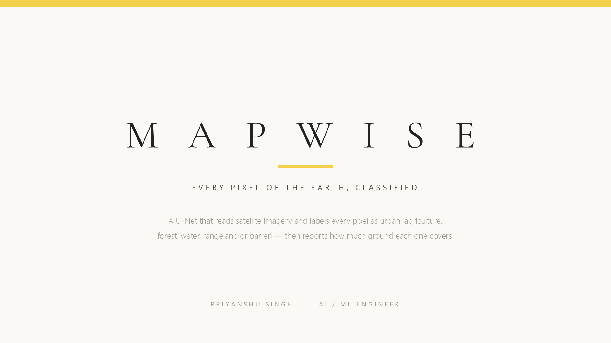

# MapWise

**Every pixel of the Earth, classified.**

A U-Net that labels satellite imagery into seven land-cover types — urban, agriculture,
rangeland, forest, water, barren — and reports how much ground each one covers. The model
runs in your browser: drop in a tile, get a colour-coded map and a ground-cover breakdown
without the image ever leaving your device.



---

## Results

Trained on [DeepGlobe land cover](https://www.kaggle.com/datasets/balraj98/deepglobe-land-cover-classification-dataset)
(723 training tiles, 80 held out): 60 epochs on a single T4 in 150 minutes, 768px crops,
flip/rotation test-time augmentation at validation.

**Mean IoU 0.685 · pixel accuracy 85.9%**

| Class | IoU |
|---|---|
| agriculture | **0.868** |
| water | **0.831** |
| forest | **0.787** |
| urban | **0.762** |
| barren | 0.518 |
| rangeland | 0.346 |
| unknown | 0.000 (void label, excluded from the mean) |

`unknown` scores zero. It is DeepGlobe's void/catch-all label and amounts to a single pixel in
the sampled training set, so there is nothing to learn from it. It is therefore excluded from the
mean IoU, the same convention PASCAL VOC and Cityscapes use for their void classes; including it
would drag the mean down by 0.09 while saying nothing about the model. Over all seven classes the
mean is 0.543. Every labelled class is reported above either way.

Water is the interesting one. It is rare in this dataset, and under plain cross-entropy a
model can ignore it entirely and still post a good pixel accuracy. Weighted Dice loss is
what takes it to 0.74.

---

## How it works

**Architecture** — U-Net. A torchvision ResNet-50 (ImageNet-pretrained) acts as the encoder,
producing a five-stage feature pyramid. The decoder is written from scratch: four upsampling
blocks, each concatenating the skip connection from the matching encoder stage, then a 1x1
convolution to seven class logits at full resolution. 32.6M parameters.

The pretrained encoder is a deliberate choice — the engineering claim here is the decoder,
the loss design and the training, not pretraining from zero.

**Loss** — Dice + inverse-frequency-weighted cross-entropy. DeepGlobe is badly imbalanced:
agriculture covers more ground than most other classes combined. Plain cross-entropy
produces a model that predicts agriculture almost everywhere and still reports a flattering
pixel accuracy, so the weighting is what makes the rare classes learnable.

Class weights use `(1/frequency) ** 0.5` rather than plain inverse frequency. Straight
inversion drives the weight of the common classes to nearly zero, and the model then stops
learning them at all.

**Data** — 2448x2448 tiles, random 768x768 crops, horizontal and vertical flips, and
90-degree rotations. Aerial imagery has no canonical "up", so rotation is a free augmentation.

**Training** — AdamW, cosine schedule, mixed precision, gradient clipping. Validation IoU is
accumulated over a confusion matrix across the whole split, not averaged per batch.

---

## Repository layout

```
src/mapwise/
  model.py        U-Net: ResNet-34 encoder + from-scratch decoder
  data.py         DeepGlobe tiles, RGB mask -> class indices, augmentation
  losses.py       Dice + weighted CE, confusion-matrix IoU tracker
train/train_seg.py    training loop, per-class IoU logged every epoch
eval/
  make_figures.py     satellite / prediction / ground-truth comparison strips
  make_iou_chart.py   per-class IoU chart
deploy/
  kaggle_train.py     probe + training jobs
  kaggle_figures.py   renders figures on Kaggle, where the dataset lives
  export_onnx.py      ONNX export + int8 quantisation
docs/               the browser demo (GitHub Pages)
presentation/       deck builder and exported slides
```

## Running it

```bash
# train (Kaggle T4; the 2.9 GB dataset is attached there and never downloaded locally)
python deploy/kaggle_train.py probe     # verify environment and data layout first
python deploy/kaggle_train.py push

# or train directly against a local copy of the dataset
python train/train_seg.py --data <deepglobe root> --epochs 24 --batch 8 --crop 512

# export for the browser
python deploy/export_onnx.py --ckpt out/mapwise/best.pt --out docs/models/mapwise.onnx
```

**Deployment** — the fp32 ONNX graph is 97.9 MB, which is a poor browser download. Dynamic
int8 quantisation takes it to 24.6 MB with 99.998% argmax agreement against fp32, so the
demo ships the quantised model and falls back to fp32 if it is absent.

---

## Demo

<https://priyanshu-singh-git.github.io/mapwise/>

Drop in a satellite tile. Inference runs locally through onnxruntime-web — no server, no
upload. The page returns the colour-coded mask at adjustable opacity plus a ground-cover
table, which is the output that actually gets used: planted area per field, built-up extent
year over year, water and forest cover for environmental and insurance work.

---

**Priyanshu Singh** — AI / ML Engineer
